Local Election for Report
================
Po-Sheng Lee
2018-12-26

前言
====

2018台灣地方選舉，結果對很多人來說應該很錯愕，對於進步派來說，明明改革已經在路上了，為何期中選舉還是烏鴉鴉，長期執政的高雄市以及2014年大幅獲勝的台中市為何都敗給保守又親中的國民黨？而對於心急如焚的台獨派來說，這不啻是一個對於這幾年改變的重重打臉，好像民眾仍然只想發大財而不管其他議題，或許對於進步派而言更令人失望的是， [外媒](https://www.bloomberg.com/news/articles/2018-11-25/pro-china-party-s-big-win-in-taiwan-puts-tsai-future-in-doubt) 都傾向於將這次選舉的結果解釋成中國勢力的勝利。市面上目前已經夠多文章談論民進黨為何失敗，從黨內 [青回陣](https://tw.appledaily.com/new/realtime/20181219/1486215/?fbclid=IwAR2RcbUPgX3Of8PLhEl6uWdSMstpLDtumKD9xLiaWxQb9K3Ryn4GlY7hufQ) 認為*改革無感*是選舉失敗的主因，然而不少人都認為，同婚議題才是民進黨掉票的主因。而林宗弘團隊基於 [縣市數據](https://twstreetcorner.org/2018/11/29/linthunghong-5/) 的推論是認為軍公教改革與農業改革的反撲，跟同婚沒什麼關係。而張育誠最近於菜市場政治學發表的 [文章](http://whogovernstw.org/2018/12/25/yuchenchang4/?fbclid=IwAR0wQXK7xSN79FfTaHlUTiWinr_95QeKKVUydJFAsfEMjWXs80pjgovRiV4) ，用區位資料反推個體可能投票意向，結果顯示，這次選舉在大部分選區都是民進黨不出來投票，真正發生選民結構變動的地方並不多。本文基本上循著張育誠文章的邏輯，以觀察2010-2018年六都的 [1] 投票率變化、真實支持率 [2] 。本文的簡單結論是，在中南部選區，問題不是2018年選太差，而是2014年選的異常的好。

資料來源與方法
--------------

本文2010年與2014年的資料主要來自 [這裡](https://hackmd.io/73-uzN0CTr6r5waEAQfmpw?view&fbclid=IwAR0-bn0S3e9bZM1V8mdx2NliFIQCkVHImoYUomixXC2oIOSA74M0ijYus58)，其中章魚哥的整理。並且加上中選會網站的原始資料以及我自己的整理。

本篇主要都是敘述性的繪圖，沒有利用推論統計（無論是線性模型推論或是生態推論）。推論統計如果作者有空的話會再嘗試處理，沒空就算了。

2010選舉概況
============

2010年地方選舉是本文設定為比較基準的選舉，以下幾張圖的X軸是各里投票率而Y軸是各里的實質支持率。我們可以看到，國民黨在六都的實質支持率都不太隨著投票率有顯著的變化，相關係數很小。而民進黨則是隨著投票率增加會有較高的支持率。簡單的解釋就是，民進黨相對較倚賴熱情出來投票的支持者，而國民黨則是有比較穩定的票源（不論是穩定的高或是穩定的低）

2014選舉概況
============

簡單來說，2014年延續了2010年的樣貌，民進黨在投票率越高的地方支持率越高，而像是台北市，國民黨甚至發生了投票率高的地方支持度反而低的狀況，這很有可能代表了選民結構的變動，但在沒有做更近一步的分析前，這也只是臆測。 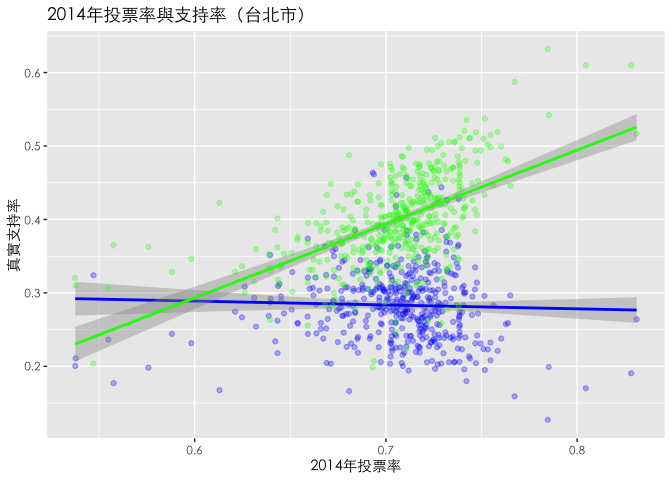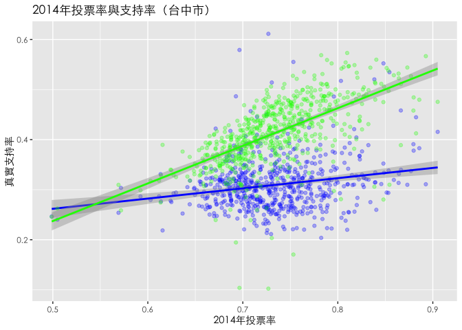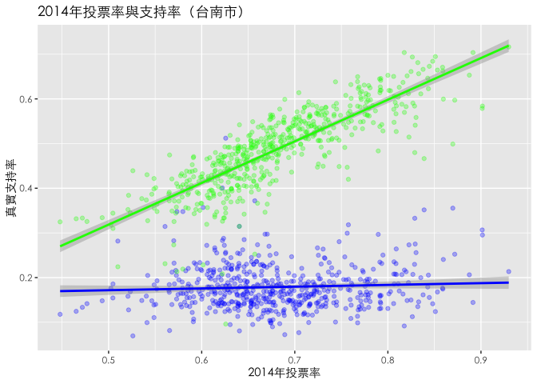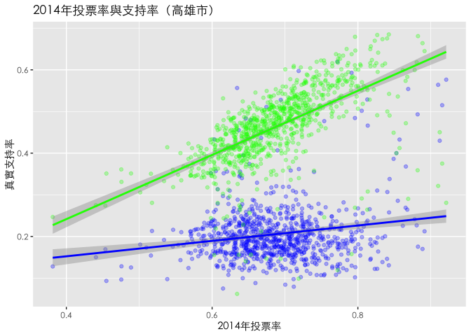

2010到2014年的變化(投票率與支持率)
----------------------------------

以下幾張圖是10-14年投票率變化與支持率變化的圖。可以看到，台北市整體而言投票率其實變化不大，但是綠營（姑且把柯文哲算綠的）整體表現都優於2010年。新北市則是整體而言投票率都下降，而投票率下降這件事看起來對於國民黨陣營比較傷，不過傷得不夠所以朱立倫還是繼續當市長。至於台中台南高雄其實有一點類似的趨勢，那就是投票率降低的鄰里很多，但是民進黨在這些鄰里都有穩住或是獲得更多的支持。這或許可以說，藍營支持者們都不出來投票了，但要確定這點必須要再跑其他推論統計。

2010到2014年的變化(兩黨支持率)
------------------------------

這組圖就可以較為完整的解釋了10-14年發生了什麼事，在台北市的各里，國民黨減少與民進黨增加的比率是接近的。新北市則是在各里兩黨支持度都減少，也就是說大家都不出來投票了。桃園則是兩黨選民都蜂擁而出投票，只是民進黨成功催出更多選票。台中、台南以及高雄都可以看到是國民黨掉的支持度比起民進黨增加的支持度還多，這也很有可能是因為失望的國民黨支持者通通窩在家裡看電視不去投票了。

2018年選舉
==========

2018選舉概況
------------

比起前幾次選舉，這次比較有趣的變化是，國民黨的支持率在六都（除了台南、桃園之外），都有隨著投票率增加而增長。這有兩種可能的解釋。1.國民黨開始懂的如何催票了；2.2010年不需要催就會出來的鐵票倉不見了，現在都需要藉由提高投票率來增加支持率了。然後台南跟桃園則是不論投票率都表現得差不多，這對於國民黨來說是個警訊，代表

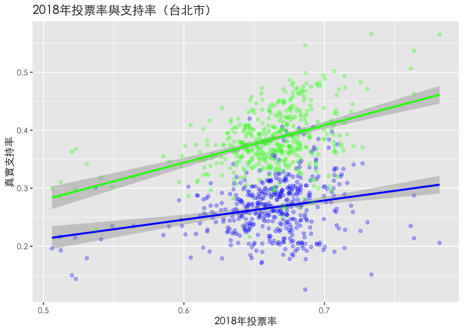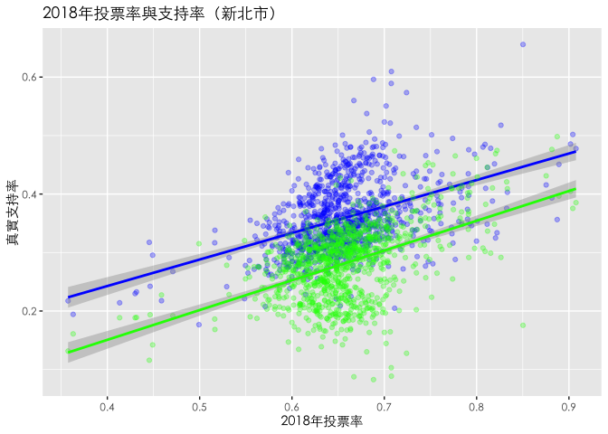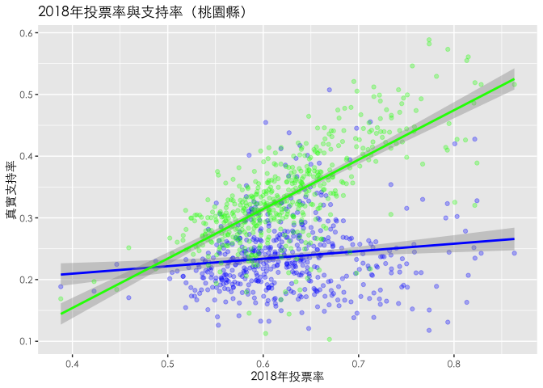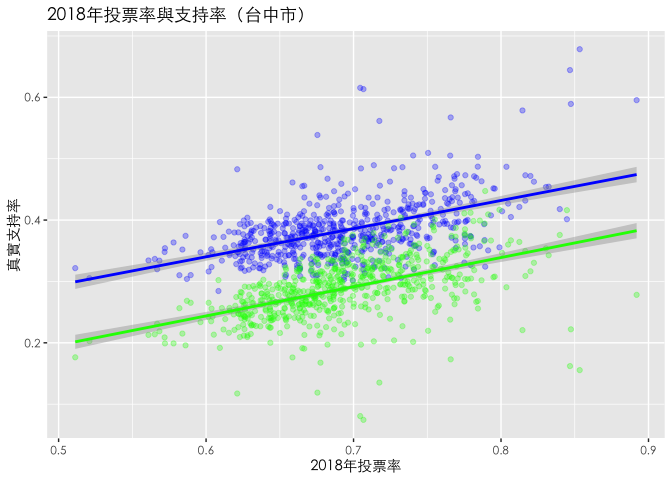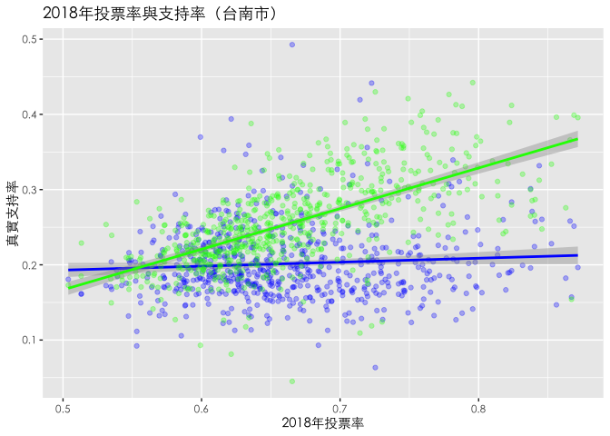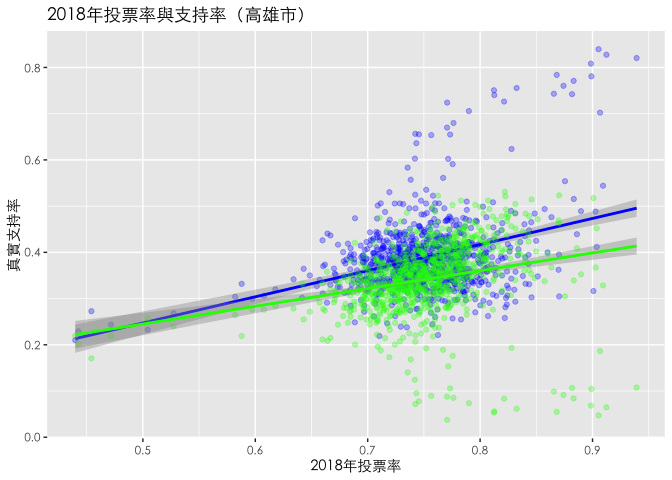

2014到2018年的變化(投票率與支持率)
----------------------------------

到了大家最關心的2018年，台北市的狀況是，整體投票率下降，但兩邊陣營支持率變化不大。新北則是國民黨大獲全勝，投票率變高的地方都有所斬獲，相對的民進黨只是在投票率高的地方表現比較沒那麼差而已。桃園則是國民黨不斷地流失支持度，而民進黨則不論投票率，幾乎都有所斬獲。台中則是投票率變低，但國民黨支持度上升而民進黨下降，這大有可能是因為民進黨不出來投而國民黨都出來投了。而高雄則是投票率整體而言變高，國民黨支持度上升而民進黨下降，這代表了除了國民黨支持者蜂湧而出外，可能也有不少民進黨倒戈。

2014到2018年的變化(兩黨支持率)
------------------------------

2010到2018年的消長
==================

以下幾個圖是總結我推論的圖，橫軸是10-14年支持度的變化而縱軸則是14-18年支持度的變化。如果資料點大多位於第一象限，代表著這區八年來是越來越偏向某個政黨，如果是在第二象限，則代表四年前選輸的票數回來了，第三象限則是這個黨在這區節節敗退，第四象限則是18年這次選舉把14年贏的吐回去了。

我們可以發現，台北市的格局在14年就定了，柯文哲增長的票並沒有在18年有太多流失，台北人就愛白色力量這一味。新北則是在14年兩黨支持率都下降（大家都不出來投），但國民黨成功拉回支持度。桃園則是民進黨持續增長、國民黨則在18年出現衰退。台中跟高雄就是民進黨把在14年贏的吐回去，國民黨把輸的贏回來，其中又以高雄的變化比起台中大。

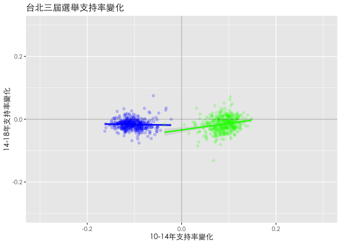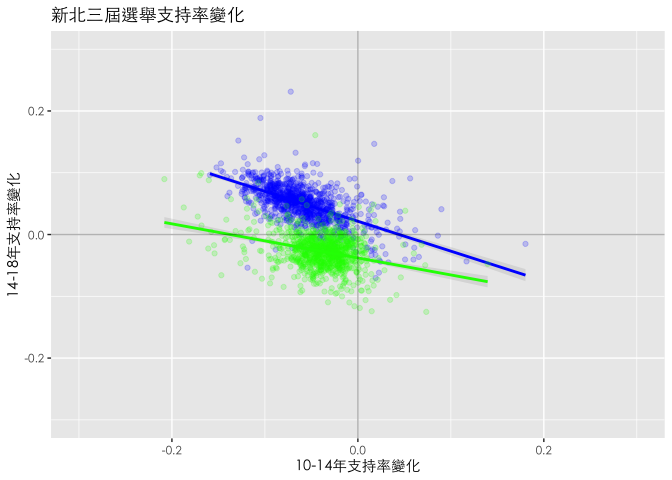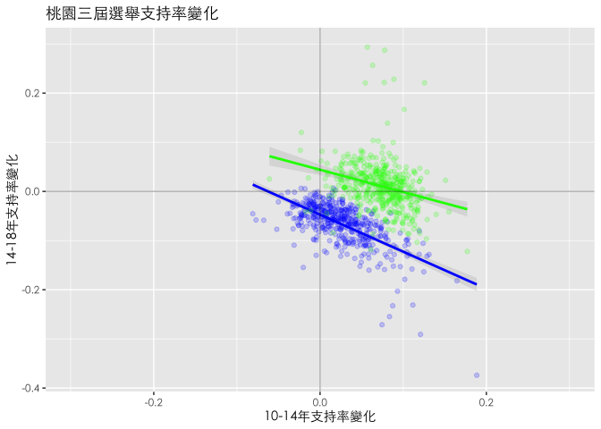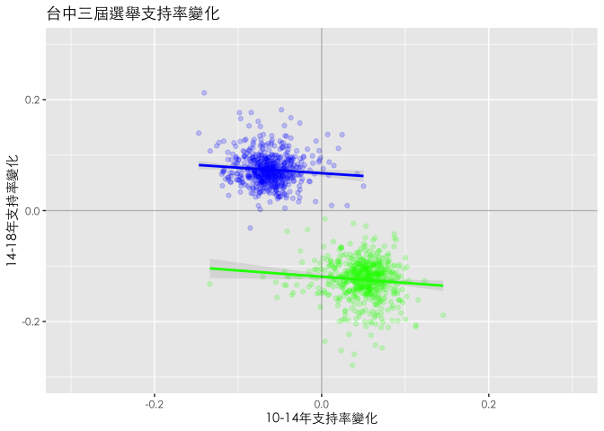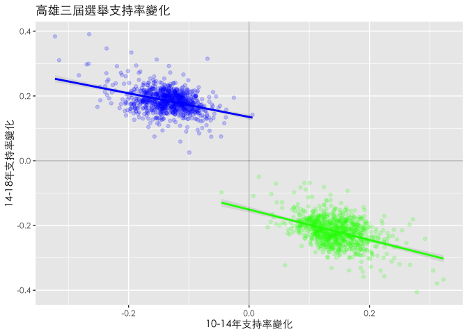

[1] 只觀察六都的原因是因為作者懶，未來有機會可以把分析範圍擴大。

[2] 真實支持率的意思是候選人得票數/選舉人數，也就是把沒出來投票的人也計入分母當中計算。
